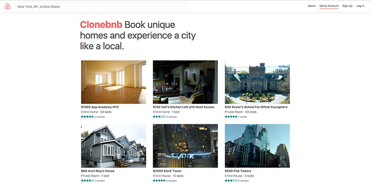
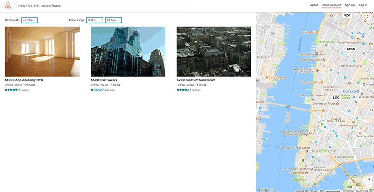
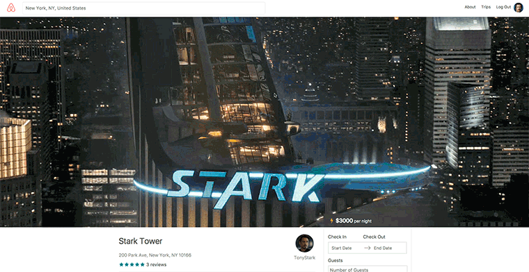

# Clonebnb
[View the Live Site](https://clone-bnb.herokuapp.com/)



## Contents
  * [About](#about)

  **Features**

  * [User Authentication](#user-authentication)
  * [Searching Rooms](#searching-rooms)
  * [Viewing Rooms & Reviews](#viewing-rooms-&-reviews)
  * [Booking Trips](#booking-trips)

## About
  Clonebnb is a full-stack web application inspired by Airbnb. My goal was to duplicate Airbnb's website as accurately as possible.

### Features
- Custom User Authentication
- Search rooms with Google Maps and filter results
- Individual room pages
- User reviews on Rooms
- Book rooms
- View current user's previous trips

### Technologies Used
* **FrontEnd:** React.js with Redux
* **Backend:** Ruby on Rails
* **Database:** PostgreSQL
* **Asset Storage:** AWS S3
* **APIs:** Google Maps, Google Places
* **Hosting:** Heroku
* **FrontEnd Libraries:** [Airbnb's react-dates](https://github.com/airbnb/react-dates)
* **BackEnd Libraries:** [BCrypt](https://rubygems.org/gems/bcrypt)

## User Authentication
  Custom user authentication is created on the back end utilizing a [BCrypt](https://rubygems.org/gems/bcrypt) Ruby Gem to hash and salt passwords. The database will only store the resulting password digest and a single user session token. Once a user is verified, a matching session token will be assigned to the user's browser cache.
  Upon a user returning, the presence of a matching session token will be verified.

## Searching Rooms
### The Search Bar


  The Search Bar in the navigation bar utilizes Google Places API which will return real locations. After the user has chosen their desired location, it will send an ajax request to Google Places, returning with a pair of `lat` and `lng` coordinates. On success, you will then be brought to a map with those coordinates as your center.
### The Map


 Utilizing Google Maps API, users may search for rooms by dragging the map. This will dynamically search the database for rooms within the bounds of the current map.
 Users may also dynamically filter the current search results base on a minimum number of guests and a price range. Users may optionally set only a max or min price or set an exact range between the two.

**Sample of filter slice of state**
 ````js
filter: {
    bounds: {
     northEast: {
       lat: 40.79527375225064,
       lng: -73.86931217382812
     },
     southWest: {
       lat: 40.731824904952944,
       lng: -74.07530582617187
     }
    },
    maxPrice: "300",
    minGuests: "2",
    minPrice: "",
    place: {
      lat: 40.7635569,
      lng: -73.972309
    }
 }
 ````

**Sample of Back End Filtering**
````ruby
rooms = params[:bounds] ? Room.in_bounds(params[:bounds]).includes(:reviews) : Room.includes(:reviews)

if (params[:minGuests])
  params[:minGuests] = "1" if params[:minGuests] == ""

  rooms = rooms.where("num_guests >= ?", params[:minGuests])
end

if (params[:minPrice] && params[:maxPrice])
  params[:minPrice] = "0" if params[:minPrice] == ""
  params[:maxPrice] = Room.maximum("price").to_s if params[:maxPrice] == ""

  rooms = rooms.where("price >= ? AND price <= ?", params[:minPrice], params[:maxPrice] )
end
````
By supplying default values if the user leaves the field blank, I can provide a much better user experience. A user may choose to filter rooms and spend no more than $100 and not care about how inexpensive a room is, and vice versa.
Filters are conditionally checked for a null presence, in some cases a simple get all may be requested and it will bypass any filtering logic.

## Viewing Rooms & Reviews


  Users may visit an individual Room page to view the dynamic data. All room and user images are hosted on an AWS S3 server and the PostgreSQL Database holds a reference to that image.

### Reviews
  Non-logged in users may read reviews and all of the core CRUD functionalities are available for authenticated users. A user may only review a room once. After leaving a review, they only have the option to update their current review or to delete it and create a new one.

## Booking Trips
  Users may book trips and select dates using [Airbnb's react-dates](https://github.com/airbnb/react-dates).
  They are brought to a receipt page and they may visit the 'Trips' to view all of their previously booked trips.
